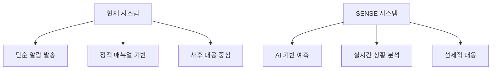

## 🚨 현재 재난 대응 시스템의 한계

### 정보 전달의 지연과 부정확성
재난 상황에서 **골든 타임**은 생명과 직결됩니다. 그러나 현재의 재난문자 시스템은 심각한 한계를 드러내고 있습니다:

{: .notice--warning}
**💭 실제 사례:** 2022년 포항 지진 당시 재난문자가 지진 발생 후 **7분**이나 늦게 발송되어 시민들이 혼란을 겪었습니다.

- **단방향 소통**: 시민의 실시간 피드백 부재
- **획일적 메시지**: 지역별, 상황별 맞춤 정보 제공 불가
- **정보 신뢰도**: 출처 불분명한 정보로 인한 혼란 가중
- **접근성 문제**: 고령자, 장애인 등 정보취약계층 소외

### 분산된 정보 체계의 문제

현재 재난 관련 정보는 여러 기관에 흩어져 있어 통합적 대응이 어렵습니다:

| 기관 | 담당 영역 | 문제점 |
|------|-----------|--------|
| 기상청 | 기상 예보 | 지역별 세부 정보 부족 |
| 소방청 | 화재/구조 | 실시간 현장 상황 공유 지연 |
| 지자체 | 지역 대응 | 중앙과 소통 체계 미흡 |
| 경찰청 | 교통/치안 | 타 기관과 정보 연계 부족 |

---

## 🔬 기술적 한계와 사각지대

### AI와 빅데이터 활용 부족



현재 시스템은 21세기 기술을 제대로 활용하지 못하고 있습니다:

- **데이터 활용도**: 수집된 데이터의 5%도 실질적 대응에 활용되지 않음
- **예측 역량**: 기상 데이터는 있지만 복합적 재해 예측 시스템 부재
- **자동화 수준**: 대부분의 판단과 대응이 여전히 수동 처리

### 멀티모달 정보 처리 한계

{: .notice--info}
**💡 핵심 문제:** 텍스트, 이미지, 음성, 센서 데이터를 통합하여 분석할 수 있는 시스템이 없어 상황 판단의 정확도가 떨어집니다.

---

## 🧠 SENSE의 해석 계층 비전

### 지능형 다층 분석 구조

SENSE는 **해석 계층(Interpretation Layer)** 개념을 도입하여 기존 시스템의 한계를 극복합니다:

```yaml
해석 계층 구조:
  Level 1 - 원시 데이터 수집:
    - IoT 센서 네트워크
    - 소셜미디어 모니터링  
    - 정부기관 공식 데이터
    
  Level 2 - 컨텍스트 이해:
    - 상황별 의미 해석
    - 지역적 특성 반영
    - 시간적 패턴 분석
    
  Level 3 - 의사결정 지원:
    - 우선순위 자동 설정
    - 최적 대응 방안 제시
    - 리스크 수준별 경보
```

### 멀티 에이전트 오케스트레이션

**🎭 각 에이전트의 역할:**
- **정보 수집 에이전트**: 실시간 다채널 모니터링
- **분석 에이전트**: AI 기반 상황 판단 및 예측
- **의사결정 에이전트**: 최적 대응 전략 수립
- **소통 에이전트**: 맞춤형 정보 전달

---

## 🌍 사회적 의미와 가치

### 정보 민주화를 통한 시민 안전

{: .notice--success}
**🎯 SENSE의 사회적 목표:** 모든 시민이 재난 상황에서 **동등하고 신속한** 정보 접근권을 가질 수 있도록 하는 것

### 예방 중심 패러다임 전환

| 기존 접근법 | SENSE 접근법 |
|-------------|---------------|
| 🚨 사후 대응 | 🔮 사전 예방 |
| 📢 일방향 전달 | 💬 양방향 소통 |
| 📊 정적 분석 | 🔄 실시간 학습 |
| 🏢 기관 중심 | 👥 시민 중심 |

### 디지털 포용성 실현

**접근성을 고려한 설계:**
- 다국어 지원 (한국어, 영어, 중국어, 베트남어 등)
- 시각/청각 장애인을 위한 멀티모달 인터페이스
- 스마트폰이 없는 시민을 위한 대안 경로
- 고령자 친화적 UI/UX

---

## 💡 결론: 미래를 위한 선택

재난은 **예측할 수 없지만 대비할 수는 있습니다**. SENSE는 단순한 기술 솔루션이 아닌, **더 안전하고 회복력 있는 사회**를 만들기 위한 종합적 접근입니다.

{: .notice}
**💭 "기술은 사람을 위해 존재한다"** - SENSE가 추구하는 핵심 철학입니다. 첨단 AI 기술을 활용하되, 최종 목표는 언제나 **사람의 생명과 안전**입니다.

### 🚀 다음 단계

지금 우리에게 필요한 것은 기존 시스템의 한계를 인정하고, **새로운 가능성에 대한 상상력**입니다. SENSE는 그 첫 걸음이 될 것입니다.

---

*"재난 앞에서 우리는 모두 평등합니다. 하지만 정보 앞에서는 그렇지 않았습니다. SENSE는 이 불평등을 해결하고자 합니다."*

<div class="text-center">
  <a href="/motivation/" class="btn btn--primary btn--large">개발 배경 자세히 보기</a>
  <a href="#architecture" class="btn btn--outline btn--large">시스템 아키텍처</a>
</div>
